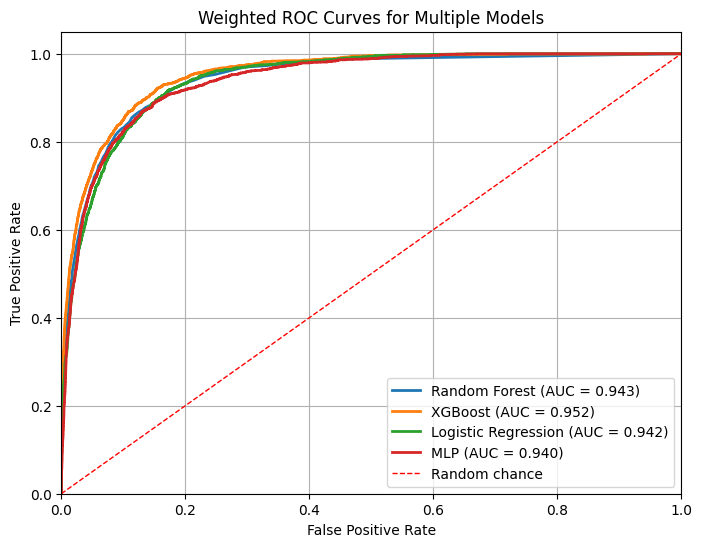
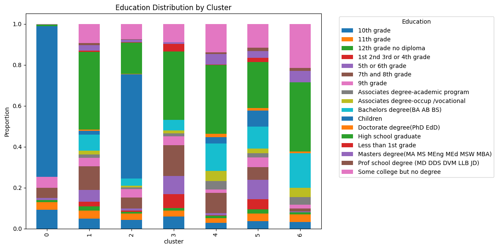
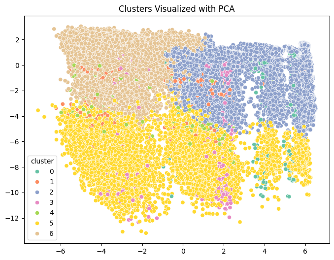

# Income Classification & Segmentation Project

## Overview
This project analyzes U.S. census data to:

1. **Classify income**: Predict whether a person earns more than $50000 per year.  
2. **Data augmentation**: Use **CTGAN** to handle class imbalance for high-income individuals.  
3. **Segmentation**: Group the population into clusters for marketing insights.

**Key features**:  
- 40 demographic and employment variables.  
- Weighted samples reflecting population distribution.  
- Models: Random Forest, Logistic Regression, XGBoost, Multi-Layer Perceptron (MLP).  
- Clustering: K-Means segmentation with profile visualizations.  

---

## Project Structure
project/

- census-bureau.data # Raw data
- census-bureau.columns # Column headers
- classification.ipynb # Preprocessing, model training, evaluation for 4 classifiers
- segmentation.ipynb # Clustering and profiling for segmentation model
- ctgan.ipynb # Data augmentation for generating synthetic minority label data (income > $50000)
- requirements.txt # Python dependencies
- synthetic_data_restored.csv # Generated synthetic data with income > $50000
- ctgan_income_model.pkl # Trained CTGAN model
- README.md # Instructions & overview

## Prerequisites

- **Python** 3.10+  
- **Dependencies** (install with `pip install -r requirements.txt`):
- **Google Colab** (recommended) with GPU runtime for CTGAN acceleration.

---

## Instructions

### 1. Google Colab (Recommended)

1. Open the notebook in [Colab](https://colab.research.google.com/).  
2. Upload `census-bureau.data` and `census-bureau.columns`.  
3. Enable GPU: `Runtime -> Change runtime type -> GPU`.  
4. Run all cells in order:  
   - `classification.ipynb`: Data preprocessing, model training, evaluation, and ROC curves.
   - `ctgan.ipynb`: CTGAN Data augmentation, training, evaluating classifiers with augmented data.
   - `segmentation.ipynb`: Clustering, cluster profiling, visualizations.

### 2. Local Execution

1. Clone or download the repository.  
2. Install all dependencies: `pip install -r requirements.txt`.  
3. Open the notebooks in **Jupyter Notebook** or **JupyterLab**.  
4. Run cells sequentially.  
   - GPU is optional, but recommended for CTGAN.  

---

## Outputs

### Classification
- Models: Random Forest, Logistic Regression, XGBoost, MLP  
- Metrics: Precision, Recall, F1-score, Accuracy, ROC-AUC  
- ROC Curve plots  

**Example**:  

  

### Segmentation
- Clustering with K-Means  
- Cluster profiling by:
  - Age, wage, capital gains/loss  
  - Education, marital status, sex, race  
- Visualizations:
  - Stacked bar plots for categorical distributions  
  - KDE plots for numerical features  

**Example Cluster Plot**:

  

---
  

---
## Data Preprocessing Notes

- Missing values replaced with `"Unknown"` or median for numeric columns.
- Columns with excessive missing values (>40%) will be dropped.
- `"Not in universe"` is treated as a regular category.
- Categorical features one-hot encoded for model input.  
- Sample weights included for classification models reflecting census stratification.  
- Synthetic data from CTGAN only added to training data, not test data.  

---

## Recommendations

- Use **Random Forest** or **XGBoost** for high performance.  
- For segmentation, **K-Means** is effective, but t-SNE or PCA can help visualize clusters.  
- The analysis can guide marketing strategies by targeting high-income clusters or demographic profiles.  
